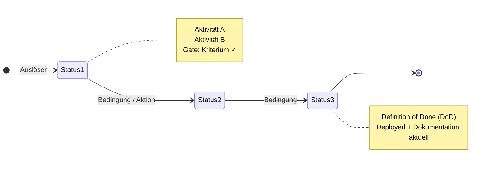
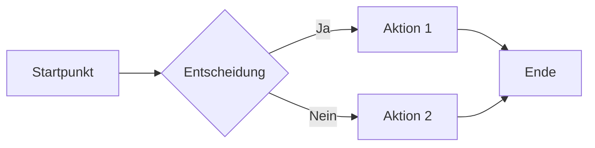
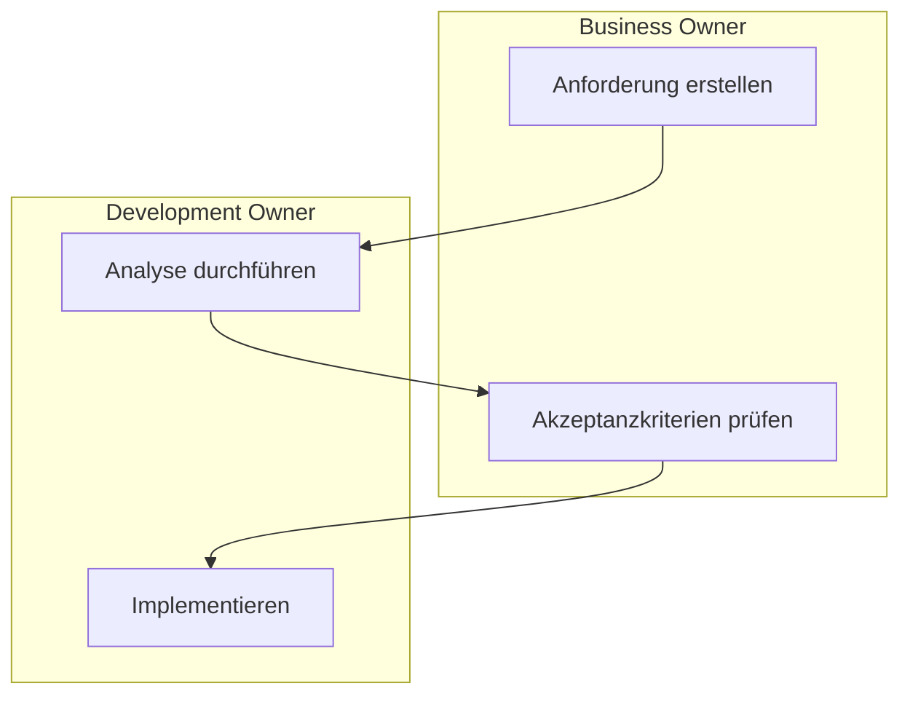

# Output-Template Reference

Goldstandard: [`wiki-md/CTRM/ctrm-feature-process.md`](../../../../wiki-md/CTRM/ctrm-feature-process.md)

---

## Markdown-Skelett (vollständig)

```markdown
# {Seitentitel}

> **Accountable for WHAT:** {Business Owner Rolle} | **Accountable for HOW:** {Dev Owner Rolle}

{Intro-Absatz: Zweck der Seite, 1–3 Sätze, kein ß}

---

## Gesamtüberblick: {Titel des Überblick-Abschnitts}

{Mermaid-Diagramm — siehe Mermaid-Rezepte unten}

---

## Phase 1 — {Titel}: {Untertitel}

> **Accountable for WHAT:** {Rolle} | **Accountable for HOW:** {Rolle}


**Screenshot-Erläuterung:** {Kompakte Annotations-Legende, z. B.: Annotiert: ① Status setzen, ② Titel eintragen, ③ Save.}

### Aktivitäten

| Nr. | Pflicht | Aktivität |
|-----|:-------:|-----------|
| 1 | ✱ | **{Aktion}** {Beschreibung} |
| 2 | ✱ | {Pflichtfeld oder -aktion} |
| 3 |   | {Optionale Aktivität} |

> ✱ Pflichtfeld oder Aktion — erforderlich zur Prozessausführung

---

## Phase 2 — {Titel}: {Untertitel (1/2)}

> **Accountable for WHAT:** {Rolle} | **Accountable for HOW:** {Rolle}


**Screenshot-Erläuterung:** {Legende}

### Aktivitäten

| Nr. | Pflicht | Aktivität |
|-----|:-------:|-----------|
...

> **⚠ Wichtig — {Titel}:**
> - {Hinweis 1}
> - {Hinweis 2}

---
```

---

## Alt-Text-Standard (detailliert)

### Struktur (5 Punkte)

```
(1) Welcher Screen und Status:
    "ADO Feature-Formular, Status «{Status}»:"

(2) Räumliches Layout:
    "Links oben {Element}. Im {Bereich} die Felder {X}, {Y}, {Z}."
    "Rechts sichtbar: Sektionen {A}, {B}, {C}."

(3) Jede Annotation ①..⑭ → Feldname + Aktion:
    "① {Feldname} ({Aktion}), ② {Feldname} ({Aktion}), ③ {Feldname}."

(4) Sichtbare Seiten-Sektionen namentlich:
    "Im Rollen-Block {Felder}. Im Datums-Block {Felder}."

(5) Besondere UI-Elemente:
    "Hervorgehobene Box «{Titel}» mit {Farbe} Rahmen und Checkliste."
    "Dropdown zeigt Optionen: {Opt1} / {Opt2} / {Opt3}."
```

### Beispiel (aus Goldstandard)

```markdown
![ADO Feature-Formular, Status «1 Funneling»: Links oben das Statusfeld auf «1 Funneling» gesetzt.
Im oberen Bereich die Pflichtfelder Title (①), Assigned To (② — zunächst sich selbst eintragen),
Area (③ — korrektes CTRM-Backlog wählen) und Iteration (④ — auf «CTRM» setzen).
Im mittleren Block Budget Responsibility (⑤), Description (⑥) und Acceptance Criteria (⑦).
Im Datums-Block Desired Date (⑧), Fixed Deadline (⑨) und Target Date (⑩).
Im Rollen-Block Initiator (⑪) und Emergency Change-Schalter (⑫).
Ganz unten Assigned To (⑬) und Save-Button (⑭).
Rechts sichtbar: Sektionen IT Deployment Relevant, Planning, Impact Analysis, Roles.
](assets/ctrm-feature-process/01-funneling.png)

**Screenshot-Erläuterung:** ADO Feature-Formular im Status *1 Funneling*.
Annotiert: ① Titel, ② Self-assign, ③ Area Path, ④ Iteration auf `CTRM`,
⑤ Budget Responsibility, ⑥ Description, ⑦ Acceptance Criteria,
⑧ Desired Date, ⑨ Fixed Deadline, ⑩ Target Date,
⑪ Initiator, ⑫ Emergency Change, ⑬ Assigned to, ⑭ Save.
```

---

## Aktivitäten-Tabelle

```markdown
| Nr. | Pflicht | Aktivität |
|-----|:-------:|-----------|
| 1 | ✱ | **Titel** einfügen |
| 2 | ✱ | In einem ersten Schritt sich selbst **assignen** |
| 3 | ✱ | **Area Path** überprüfen (zuständiges Backlog) |
| 4 |   | Desired Date einfüllen |
```

Regeln:
- `✱` in Pflicht-Spalte = Pflichtaktion; leer = optional
- Aktion-Verben **fett** (`**Titel** einfügen`, **nicht** `Titel **einfügen**`)
- Code-Inhalte in Backticks: `` `CTRM` ``, `` `True` ``
- Bei Unter-Aktivitäten: `2a)`, `2b)` als separate Zeilen ohne Nr., mit Leerzeichen-Einrückung

---

## Mermaid-Rezepte

### State-Diagram (für Prozess-Flows / Status-Übergänge)



### Flowchart (für einfachere Abläufe)



### Swimlane (für Rollen-getrennte Prozesse)



**Tipps:**
- Gate-Punkte als `note right of` in stateDiagram oder als `{Raute}` in flowchart
- ⚡ für Gates im Note-Text: `⚡ Gate: Definition of Ready (DoR)`
- Lange Node-Labels in mehrere Zeilen: `A["Zeile 1\nZeile 2"]`
- Bei Fehler `Parse error`: Node-Labels vereinfachen, Sonderzeichen in Anführungszeichen

---

## Asset-Naming

| Konvention | Beispiel |
|-----------|---------|
| Basis: `NN-shortname.png` | `01-funneling.png` |
| Unter-Schritte: `NNa-` / `NNb-` | `02a-analyzing-1-2.png`, `02b-analyzing-2-2.png` |
| Shortname: Englisch oder Deutsch, Bindestriche | `ready-for-flight.png`, `done.png` |
| Ordner: `assets/{slug}/` | `assets/ctrm-pbi-process/` |
| NN: zweistellig, führende Null | `01`, `02`, `03` … |

---

## Hinweis-Blockquotes

```markdown
> ✱ Pflichtfeld oder Aktion — erforderlich zur Prozessausführung

> **⚠ Wichtig — {Titel}:**
> - {Hinweis 1}
> - {Hinweis 2}

> \*\* Muss spätestens in Phase X auf `0` oder `3` gesetzt sein.
>
> \*\*\* {Weitere Fussnote mit Verweis auf Kontakt oder Prozess.}
```

---

## Sprach-Checkliste (DE-CH)

| Regel | Falsch | Richtig |
|-------|--------|---------|
| Kein ß | `müssen`, `Straße` | `muessen`, `Strasse` |
| Kein Gendern | `Mitarbeiter:innen` | `Mitarbeiter` |
| Datum | `2024-01-15` | `15.01.2024` |
| Anführungszeichen | `"Funneling"` | `«Funneling»` oder *Kursiv* |
| Code-Werte | `CTRM`, `True`, `False` | in Backticks: `` `CTRM` `` |
